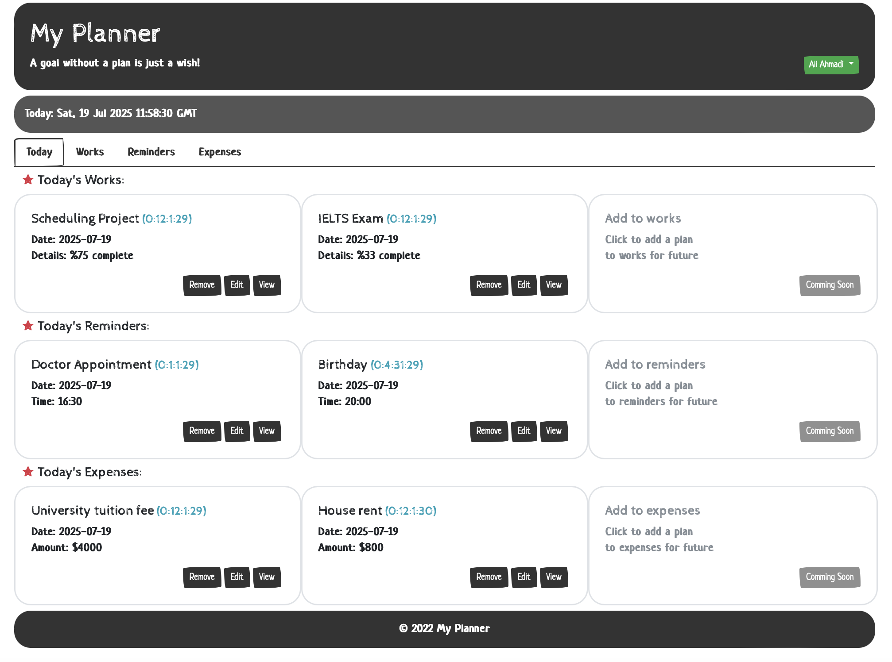

# 🗓️ My Planner

> A goal without a plan is just a wish!

**My Planner** is a simple full-stack productivity tool that helps users organize their daily **tasks**, **reminders**, and **expenses**. Built with React (component-based) on the frontend and Express/MongoDB on the backend, the application supports user authentication, secure data handling, and a clean interface to plan your day efficiently.

---

## 📦 Features

- ✅ User Authentication (bcrypt + cookies)
- 📋 Daily Work Planning with % Completion
- ⏰ Reminder System with Time Display
- 💸 Expense Tracker with Amount Breakdown
- 💾 Data persistence via MongoDB
- 🔐 Cookie-based session management
- 🧭 Routing using React Router
- 🧱 Component-based UI with React-Bootstrap

---

## 🚀 Tech Stack

### Frontend
- React
- React Router
- React-Bootstrap

### Backend
- Express.js
- MongoDB + Mongoose
- Bcrypt for Password Hashing

---
